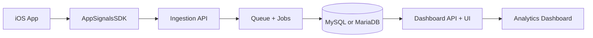

<div align="center">


# AppSignals Analytics

Self-hosted analytics for iOS apps with first-party data ownership.

[](https://github.com/adgan11/AppSignalsAnalytics/actions/workflows/ci.yml)
[](./LICENSE)
[](./backend/composer.json)
[](./backend)
[](./AppSignalsSDK/Package.swift)
[](./AppSignalsSDK/Package.swift)
[](https://github.com/adgan11/AppSignalsAnalytics/stargazers)

</div>

## Overview
AppSignals Analytics is an open-source analytics stack for iOS products. It combines a Laravel backend dashboard, a Swift SDK, and a demo app so teams can run analytics on their own infrastructure.

## Project Screenshot
[](https://www.canva.com/design/DAGzndNFwK4/JsoafQvmnwj7iqnb_xNWNA/view?utm_content=DAGzndNFwK4&utm_campaign=designshare&utm_medium=embeds&utm_source=link)

## Features
- Event ingestion with batching and custom properties
- Crash reporting with dSYM-based symbolication support
- Session replay wireframes with redaction-aware capture
- Dashboard views for events, crashes, replays, and product metrics
- Real-time updates via Laravel Reverb
- API key-based ingestion and project-level isolation
- Privacy-first design with self-hosted control

## Repository Structure
| Path | Description |
| --- | --- |
| `backend/` | Laravel backend, ingestion APIs, dashboard UI, queues, scheduler |
| `AppSignalsSDK/` | Swift Package SDK for iOS/macOS event and crash tracking |
| `AppSignalsDemo/` | Example iOS app integrated with the SDK |
| `Documentation/` | Setup guide, deployment templates, server requirements |

## Architecture


## Quick Start
### Prerequisites
- PHP 8.2+
- Composer
- Node.js 20+ and npm
- MySQL 8.0+ or MariaDB 10.6+
- Xcode (for SDK/demo app development)

### 1. Start the Backend
```bash
cd backend
composer install
npm install
cp .env.example .env
php artisan key:generate

# Set DB_* values in .env, then:
php artisan migrate --seed
```

Run services (recommended helper):
```bash
./start_dev.sh
```

Or run manually:
```bash
php artisan serve --host=127.0.0.1 --port=8000
php artisan reverb:start
php artisan queue:work
npm run dev
```

### 2. Add the SDK
Use Swift Package Manager from local path:

```swift
dependencies: [
    .package(path: "../AppSignalsSDK")
]
```

Initialize in your app:

```swift
import AppSignalsSDK

AppSignals.initialize(
    apiKey: "ok_live_your_api_key_here",
    serverURL: "http://127.0.0.1:8000"
)
AppSignals.debugLogging = true
AppSignals.enableAutoTracking = true
AppSignals.enableCrashReporting = true
```

Track your first event:

```swift
AppSignals.track("button_clicked", properties: [
    "screen": "home"
])
```

## API Endpoints
| Endpoint | Method | Purpose |
| --- | --- | --- |
| `/api/v1/ingest` | `POST` | Batched event ingestion |
| `/api/v1/crash` | `POST` | Crash payload ingestion |
| `/api/v1/replay` | `POST` | Session replay frame ingestion |

## Documentation
- Full docs: `Documentation/index.html`
- Backend details: `backend/README.md`
- SDK details: `AppSignalsSDK/README.md`
- Deployment templates: `Documentation/deployment-templates/`

## Development
Backend tests:

```bash
cd backend
php artisan test
```

SDK tests:

```bash
cd AppSignalsSDK
swift test
```

## Contributing
Issues and pull requests are welcome.

1. Fork the repository
2. Create a feature branch
3. Add tests for behavior changes
4. Open a pull request with a clear summary

## Star History
[](https://www.star-history.com/#adgan11/AppSignalsAnalytics&type=date&legend=top-left)

## Support
If this project helps you, support development here:

https://shabgagan.gumroad.com/coffee

## License
Licensed under the MIT License. See `LICENSE`.
